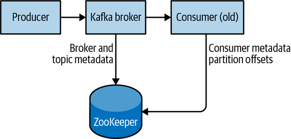

# Kafka 201
Beyond Kafka...

Recursos y pasos importantes para el curso

## Antes de empezar :exclamation:
Para realizar este curso es importante tener instalado los siguientes programas:

- Java > 8
- Kafka (https://kafka.apache.org/quickstart) < v2.2+ (en adelante)
- Tener un IDE instalado como [Visual Studio Code](https://code.visualstudio.com/download) o [IntelliJ](https://www.jetbrains.com/idea/download)
- Maven

Para la instalación en Windows seguir el siguiente video:
* https://youtu.be/aKDWWICgfA0 (en)
* https://youtu.be/u5THXLlW0tU (es)

## Antes del curso
Un recordatorio de los siguientes temas:
* [Setup | Instalación](https://kafka.apache.org/quickstart) (Para la instalación es importante ver la sección **Antes de empezar**)
* [¿Qué es Kafka? | What is Kafka?](https://www.confluent.io/what-is-apache-kafka/) - [¿Comó funciona Kafka? | What is Apache Kafka?](https://www.geeksforgeeks.org/what-is-apache-kafka-and-how-does-it-work/?ref=rp)
* [Topics, partitions y offsets](https://medium.com/event-driven-utopia/understanding-kafka-topic-partitions-ae40f80552e8)

# :computer: Actividades

## Kafka CLI (Command Line Interface) 201
Una vez que Kafka fue descargado e instalado, procederemos a validar que este bien instalado para comenzar las pruebas

### Iniciar ZooKeeper service y Kafka Server
Abrimos una terminal y nos movemos al directorio donde se descargo Kafka
`$cd C:/Downloads/kafka_2.13-3.2.1`

``` bash
# Iniciamos Zookeeper (Zookeeper sera nuestra herramienta aunada a Kafka para mantener los logs/mensajes guardados)

# Mac/Linux
bin/zookeeper-server-start.sh config/zookeeper.properties

# Windows
.\bin\windows\zookeeper-server-start.bat .\config\zookeeper.properties

# si todo funciona bien, nos saldra un log parecido a
# INFO binding to port 0.0.0.0/0.0.0.0:2181 (org.apache.zookeeper...)
# En caso de falla, usualmente es porque el puerto 2181 esta ocupado y debemos cambiar el puerto editando el archivo de
# zookeeper.properties y modificando el puerto
```

Luego abrimos una segunda terminal, y nos movemos de nuevo al directorio de kafka
```bash
# Inicializamos el server de kafka con el comando
# Mac/Linux
bin/kafka-server-start.sh config/server.properties

# para Windows
.\bin\windows\kafka-server-start.bat .\config\server.properties
# si se inicializa bien veremos el log
# INFO [KafkaServer id=0] started (kafka.server....)
```

### Crear un TOPIC para guardar los eventos
Actualmente tenemos corriendo dos servicios:
- Zookeeper que trabaja de la mano de Kafka para guardar los logs (como si fuera nuestra Base de datos)
- El server/broker de Kafka

Ahora en una tercera terminal hacemos lo siguiente
```bash
bin/kafka-topics.sh --create --topic <topic-name> --bootstrap-server localhost:<kafka-server-port>
# el puerto base para el server de kafka suele ser el 9092

# para Windows
.\bin\windows\kafka-topics.bat --create --topic <topic-name> --bootstrap-server localhost:<kafka-server-port>
# .\bin\windows\kafka-topics.bat --create --topic topic_demo --bootstrap-server localhost:9092
```

Al crear el TOPIC nos saldra un log similar a:
`Created topic <topic-name>`

Para validar que se creo el TOPIC podemos utilizar el comando `--describe` que nos indica como esta creado el topico o el comando `--list` que nos muestra la lista de topicos creados en Kafka.

Utilizar la flag `--describe` no solo nos mostrara que el topico ha sido creado sino tambien podremos validar los datos de *replicación* 

```bash
# Describe
# Mac/Linux
bin/kafka-topics.sh --describe --topic <topic-name> --bootstrap-server localhost:<kafka-server-port>

#Windows
.\bin\windows\kafka-topics.bat --describe --topic <topic-name> --bootstrap-server localhost:<kafka-server-port>

# list
# Mac/Linux
bin/kafka-topics.sh --list --bootstrap-server localhost:<kafka-server-port>

# Windows
.\bin\windows\kafka-topics.bat --list --bootstrap-server localhost:<kafka-server-port>
```

### Replicación de topicos

Del cluster de brokers, forzaremos el tirar un broker (escoger cualquier broker) `Ctrl + C`

y validamos de nuevo como se comporta el topico de nuevo

```bash
./bin/windows/kafka-topics.sh --bootstrap-server localhost:2181 --describe --topic <nombre_del_topico>
```

Para crear un **topic** con `particiones` en especifico + `replication factor`
```bash
# Mac/Linux
bin/kafka-topics.sh --create --topic <topic-name> --partitions <no_particiones> --replication-factor <no_replicacion> 
--bootstrap-server localhost:<kafka-server-port>

# Windows
.\bin\windows\kafka-topics.bat --create --topic <topic-name> --partitions <no_particiones> --replication-factor <no_replicacion>
--bootstrap-server localhost:<kafka-server-port> 
```

### Generar Multiples Brokers en Kafka

```bash
# Hay que crear un nuevo archivo similar al de server.properties x cada nuevo broker
cp ./kafka/config/server.properties ./kafka/config/server-1.properties

# validar que se haya generado la copia
ls
```

```bash
# modificar la configuración del broker
nano ./kafka/config/server-1.properties
# dentro del archivo de server-#.properties, modificar:
# la sección de broker.id y modificar el valor por 1
broker.id=1

# cambiar el # del puerto a 9093 y auto-create a false
listeners=PLAINTEXT://localhost:9093
auto.create.topics.enable=false

# cambiar el directorio de logs a Kafka-log-1 (seleccionamos el directorio donde guadaremos los logs del broker nuevo)
log.dirs=C://kafka/kafka-logs-1
```

Replicamos los pasos anteriores para generar otro broker, modificando los datos como:
- `broker.id=2`
- `listeners=PLAINTEXT://localhost:9094`
- `auto.create.topics.enable=false`
- `log.dirs=<path_para_los_logs_del_broker_2>`

### Inicializar los nuevos brokers
> Nota: Se debe tner corriendo el broker default de Kafka y el Zookeeper

- Inicializamos el primer broker
```bash
./bin/kafka-server-start.sh ./config/server-1.properties
```

- Inicializamos el segundo broker
```bash
./bin/kafka-server-start.sh ./config/server-2.properties
```

Finalmente generamos un cluster de Kafka con 3 brokers (el broker default, broker 1 y broker 2)

### Configurar Retencion por Tamaño y Tiempo
```bash
# Mac/Linux
bin/kafka-configs.sh --bootstrap-server localhost:<port> --alter --entity-type topics --entity-name <topic> --add-config retention.ms=-1,retention.bytes=524288000

# Windows
.\bin\windows\kafka-configs.bat --bootstrap-server localhost:<port> --alter --entity-type <topic> --entity-name configured-topic --add-config retention.ms=-1,retention.bytes=524288000
```

### Configurar o modificar minimo de factor de replicación para `ack=all` (in-sync replicas)
```bash
# Mac/Linux
bin/kafka-configs.sh --bootstrap-server localhost:9092 --alter --entity-type <topic> --entity-name <topic_name> --add-config min.insync.replicas=<no_replicas>

# Windows
.\bin\windows\kafka-configs.bat --bootstrap-server localhost:9092 --alter --entity-type <topic> --entity-name <topic_name> --add-config min.insync.replicas=<no_replicas>
```

### Escribir eventos en el TOPIC [Opcional]

```bash
bin/kafka-console-producer.sh --topic <topic-name> --bootstrap-server localhost:<kafka-server-port>
> <type-data>
> <type-data>
> <type-data>

# para Windows
.\bin\windows\kafka-console-producer.bat --topic <topic-name> --bootstrap-server localhost:<kafka-server-port>
> <data>
> <data>
> <data>
```


### Leer los eventos del TOPIC [Opcional]

```bash
bin/kafka-console-consumer.sh --topic <topic-name> --bootstrap-server localhost:<kafka-server-port>

# para Windows
.\bin\windows\kafka-console-consumer.bat --topic <topic-name> --bootstrap-server localhost:<kafka-server-port>
```

Añadir la flag `--from-beginning` despues del nombre del topic
```bash
.\bin\windows\kafka-console-consumer.bat --topic <topic-name> --from-beginning --bootstrap-server localhost:<kafka-server-port>
```

Ejemplo de como se visualiza Kafka



### Practica
La practica y ejercicios las podemos encontrar en el directorio de practica


# :books: Para aprender mas
* Kafka: The Definite Guide, 2nd Edition | O'Reilly Media
* https://kafka.apache.org/
* https://developer.confluent.io/learn-kafka/
* https://www.pluralsight.com/courses/apache-kafka-getting-started
* [Algoritmo Paxos y Raft](https://medium.com/@juan.baranowa/algor%C3%ADtmos-de-consenso-raft-y-paxos-b252e51e911a)
* [Aprendiendo Apache Kafka Pt 1](https://www.enmilocalfunciona.io/aprendiendo-apache-kafka-parte-1/)
* [Aprendiendo Apache Kafka Pt 2](https://www.enmilocalfunciona.io/aprendiendo-apache-kafka-parte-2-2/)
* [Aprendiendo Apache Kafka Pt 4 - Instalación](https://www.enmilocalfunciona.io/aprendiendo-apache-kafka-parte-4/)
