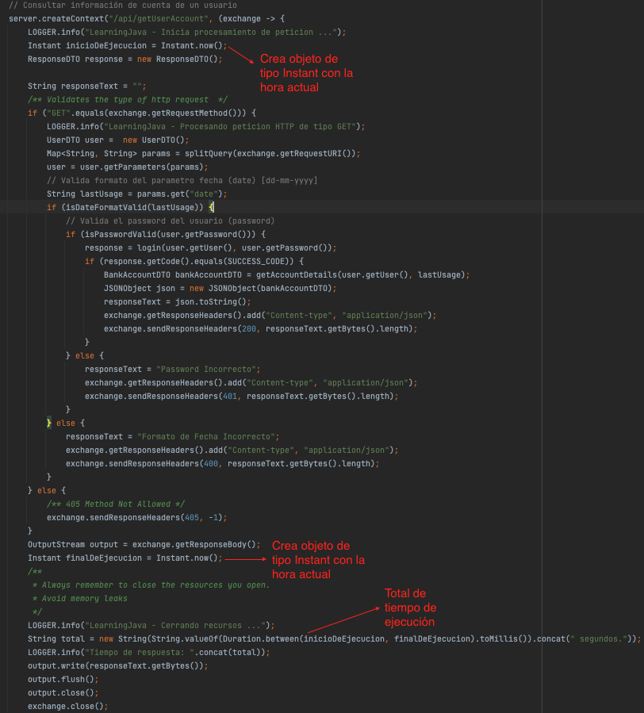

# :hammer_and_wrench:  Requisitos
- Java 11
- IDE
    * [Visual Studio Code](https://code.visualstudio.com/download)
    * [IntelliJ](https://www.jetbrains.com/idea/download)
- [Postman](https://www.postman.com/downloads/)
- [json-20220320.jar](https://repo1.maven.org/maven2/org/json/json/20220320/)

# :pencil: Actividad
## Consultar información de todas las cuentas bancarias existentes.
> Esta actividad continua a la descrita en la clase anterior: [README](https://github.com/wizelineacademy/BAZJAVA12022/blob/main/3/EstructurasDatos/README.md)
1. Modificar el DTO __BankAccountDTO__ de manera, que se haga uso de la clase _LocalDateTime_ en las propiedades _lastUsage_ y _creationDate_.
    ```java
    public class BankAccountDTO {
      private long accountNumber;
      private String accountName;
      private String user;
      private double accountBalance;
      private AccountType accountType;
      private String country;
      private boolean accountActive;
      private LocalDateTime creationDate; // <- Cambiar a tipo de dato LocalDateTime
      private LocalDateTime lastUsage; // <- Crear nueva propiedad
    }
    ``` 
    > Recuerda generar los getters y setters correspondientes a cada propiedad. En el método _getLastUsage()_ generar el valor actual de la fecha. (LocalDateTime.now();) 

2. Modificar la implementación del método _(getAccounts)_ que regresa la lista de cuentas asi como también, el método _(buildBankAccount)_ que construye los objetos de tipo _BankAccountDTO_, también es necesario modificar el método _getAccountDetails_.
    ```java
        public class BankAccountBOImpl implements BankAccountBO{
            @Override
            public List<BankAccountDTO> getAccounts() {
            // Definicion de lista con la informacion de las cuentas existentes.
            List<BankAccountDTO> accountDTOList = new ArrayList<>();
            accountDTOList.add(buildBankAccount("user3@wizeline.com", true, Country.MX, LocalDateTime.now().minusDays(7)));
            accountDTOList.add(buildBankAccount("user1@wizeline.com", false, Country.FR, LocalDateTime.now().minusMonths(2)));
            accountDTOList.add(buildBankAccount("user2@wizeline.com" ,false, Country.US, LocalDateTime.now().minusYears(4)));
            return accountDTOList;
        }

        @Override
        public BankAccountDTO getAccountDetails(String user, String lastUsage) {
            DateTimeFormatter dateformatter = DateTimeFormatter.ofPattern("dd-MM-yyyy");
            LocalDate usage = LocalDate.parse(lastUsage, dateformatter);
            return buildBankAccount(user, true, Country.MX, usage.atStartOfDay());
        }

        // Creación de tipo de dato BankAccount
        private BankAccountDTO buildBankAccount(String user, boolean isActive, Country country, LocalDateTime lastUsage) {
            BankAccountDTO bankAccountDTO = new BankAccountDTO();
            bankAccountDTO.setAccountNumber(randomAcountNumber());
            bankAccountDTO.setAccountName("Dummy Account ".concat(randomInt()));
            bankAccountDTO.setUser(user);
            bankAccountDTO.setAccountBalance(randomBalance());
            bankAccountDTO.setAccountType(pickRandomAccountType());
            bankAccountDTO.setCountry(getCountry(country));
            bankAccountDTO.getLastUsage(); // <- Se invoca al metodo de acceso get() para obtener la fecha actual
            bankAccountDTO.setCreationDate(lastUsage);
            bankAccountDTO.setAccountActive(isActive);
            return bankAccountDTO;
        }
   }
    ```
   > Las modificaciones comprende el generar tipos de datos _LocalDateTime_ y convertir tipos de dato _String_ a _LocalDateTime_
3. En la clase principal __LearningJava__ obtener la información del tiempo de procesamiento de algunos métodos.
   

# :computer: Requests
``` bash
curl --location --request GET 'http://localhost:8080/api/getUserAccount?user=user1@wizeline.com&password=Pass1@&date=12-03-2018'
```
# :bulb: Nota
La petición anterior :point_up_2: se puede importar en Postman simplemente copiando y pegándola en el apartado __Raw text__ que aparece después de hacer clic en el botón de __importar__.

# :white_check_mark: 200 Response
```json
{
    "country": "Mexico",
    "accountActive": true,
    "accountName": "Dummy Account 5",
    "accountType": "AHORRO",
    "lastUsage": "2022-09-08T14:55:19.512991",
    "accountNumber": -2160093231463591361,
    "accountBalance": 2726.736854261657,
    "creationDate": "2018-03-12T00:00",
    "user": "user1@wizeline.com"
}
``` 
# :x: 400 Response
```json
{
   Formato de Fecha Incorrecto
}
``` 
# :no_entry: 401 Response
```json
{
   Password Incorrecto
}
``` 


# :books: Recursos
- [Java Date Time Tutorial](https://jenkov.com/tutorials/java-date-time/index.html)
- [Java Date-Time Packages](https://docs.oracle.com/javase/8/docs/technotes/guides/datetime/index.html)
- [Introduction to the Java 8 Date/Time API](https://www.baeldung.com/java-8-date-time-intro)
- [Chapter 17Use Java SE 8 Date/Time API](https://www.oreilly.com/library/view/oca-ocp/9781119363392/c17.xhtml)
