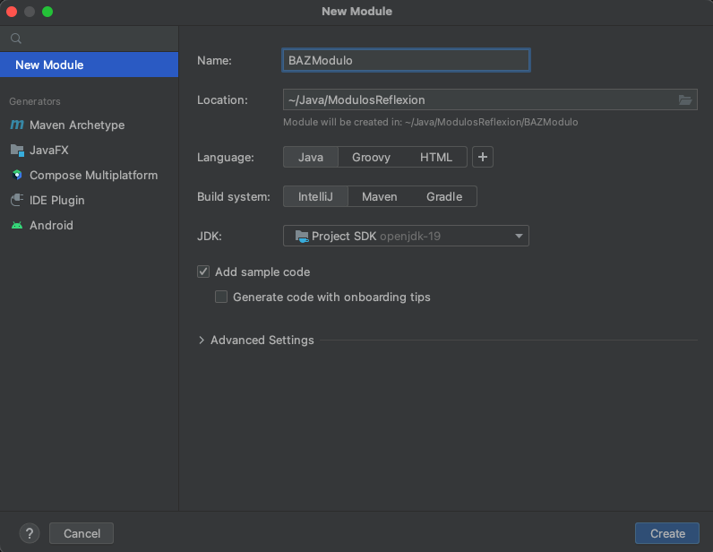
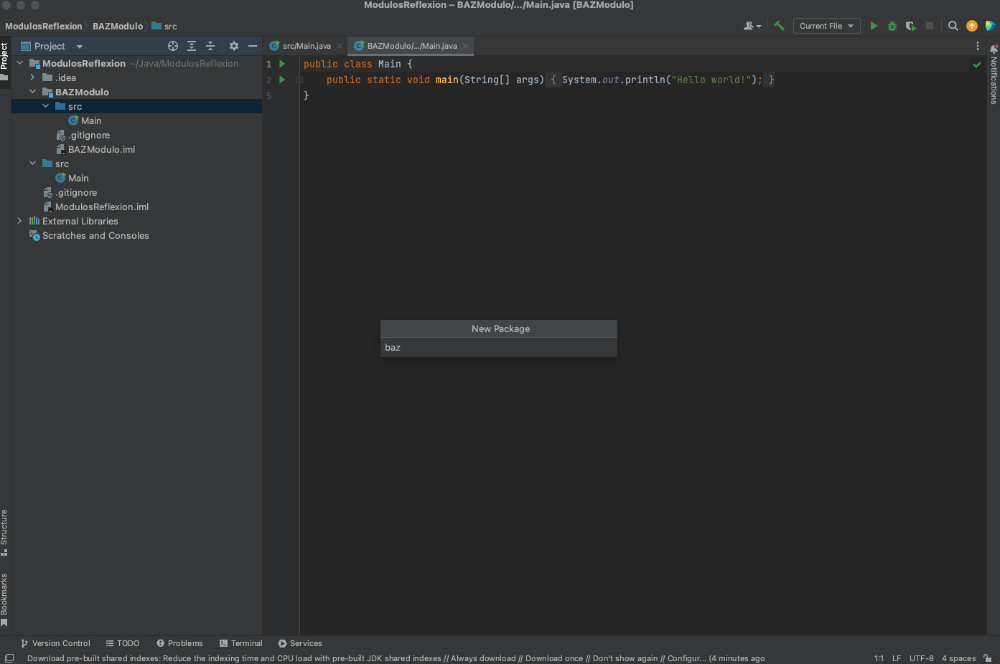
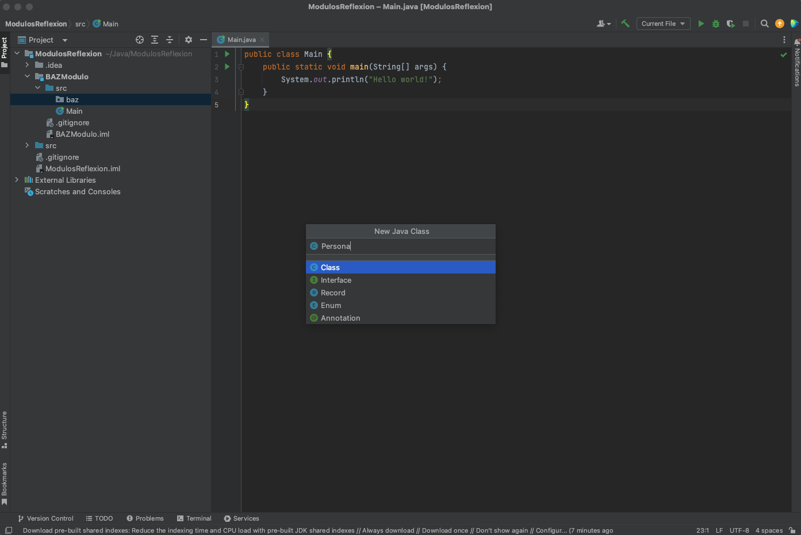
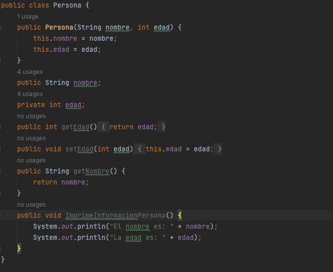
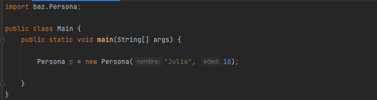
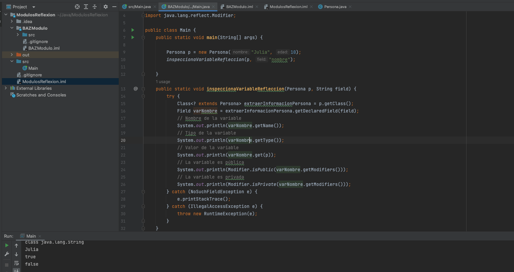

# Java

# Requisitos

- Java 11 o superior
- [IntelliJ](https://www.jetbrains.com/idea/download)

## Java línea de comando
Una vez que JDK y Intellij fue descargados e instalados, procederemos a validar que este bien instalado para comenzar las pruebas

## Temario

### Módulos

Creación de Módulo, Paquetes, Clases, exportadores y privados.

### refleccion

Importar nuestro módulo, instanciar un objeto de una clase e inspeccionar sus funciones y propiedades mediante refleccion

### A continuación, se listaran los pasos para a seguir para la actividad de este módulo.

1. Comenzamos abriendo nuestro IntelliJ y vamos a la opción de crear nuevo proyecto Java llamado ModulosRefleccion.


2. IntelliJ nos muestra nuestro proyecto Java.


3. Ahora vamos a dar click derecho sobre nuestro proyecto y daremos click en "New Module". Lo llamaremos "BAZModulo":
  


4. Ahora vamos a crear un paquete llamado baz:



5. Dentro del paquete baz vamos a crear la clase Persona:

- Persona.java



6. Para ser su retroinspección mediante refleccion, la clase Persona tendrá la siguiente composición:

### Propiedades.

- private String nombre
- private int edad

### Métodos.
 - getNombre
 - ImprimeInformaciónPersona
 - getEdad
 - setEdad(int edad)
 
 Copie y pegue el siguiente código dentro de la clase Persona:

```
    public Persona(String nombre, int edad) {
        this.nombre = nombre;
        this.edad = edad;
    }
    public String nombre;
    private int edad;
    public int getEdad() {
        return edad;
    }
    public void setEdad(int edad) {
        this.edad = edad;
    }
    public String getNombre() {
        return nombre;
    }
    public void ImprimeInformacionPersona() {
        System.out.println("El nombre es: " + nombre);
        System.out.println("La edad es: " + edad);
    }
```


7. Nos vamos a nuestro archivo Main.java y creamos un objeto de la clase Persona:

```
    import baz.Persona;

public class Main {
    public static void main(String[] args) {

        Persona p = new Persona("Julia", 10);

    }
}
```



8. Utilizando refleccion vamos a analizar la propiedad nombre de nuestra clase Persona. Copie y pegue la función inspeccionaVaribaleRefleccion e invoquela enviándole el objeto creado de la clase Persona y la propiedad nombre:

```
  public static void inspeccionaVariableRefleccion(Persona p, String field) {
        try {
            Class<? extends Persona> extraerInformacionPersona = p.getClass();
            Field varNombre = extraerInformacionPersona.getDeclaredField(field);
            // Nombre de la variable
            System.out.println(varNombre.getName());
            // Tipo de la variable
            System.out.println(varNombre.getType());
            // Valor de la variable
            System.out.println(varNombre.get(p));
            // La variable es pública
            System.out.println(Modifier.isPublic(varNombre.getModifiers()));
            // La variable es privada
            System.out.println(Modifier.isPrivate(varNombre.getModifiers()));
        } catch (NoSuchFieldException e) {
            e.printStackTrace();
        } catch (IllegalAccessException e) {
            throw new RuntimeException(e);
        }
    }
```



9. Por último, utilizando refleccion vamos a analizar el metodo getNombre de nuestra clase Persona. Copie y pegue la función inspeccionaMetodoRefleccion e invoquela enviándole el objeto creado de la clase Persona y el nombre de método getNombre:

```
  public static void inspeccionaMetodoRefleccion(Persona p, String m) {
        try {
            Class<? extends Persona> extraerInformacionPersona = p.getClass();
            Method metodo = extraerInformacionPersona.getMethod(m);
            //Nombre del método
            System.out.println(metodo.getName());
            // Cantidad de parametros
            System.out.println(metodo.getParameterCount());
            // El método es publico?
            System.out.println(Modifier.isPublic(metodo.getModifiers()));
            // El método es privado?
            System.out.println(Modifier.isPrivate(metodo.getModifiers()));
            // Tipo del return
            System.out.println(metodo.getGenericReturnType().getTypeName());
            // Invocar el método
            System.out.println(metodo.invoke(p));
        } catch (NoSuchMethodException e) {
            e.printStackTrace();
        } catch (InvocationTargetException e) {
            throw new RuntimeException(e);
        } catch (IllegalAccessException e) {
            throw new RuntimeException(e);
        }
    }
```


# :books: Para aprender mas
* [Java](https://dev.java)
* [Java Documentation](https://docs.oracle.com/en/java/)
* [Learn Java](https://dev.java/learn/)
* [Frequently Asked Questions (FAQs)](https://dev.java/learn/faq/)
* [Java Youtube](https://www.youtube.com/java)
* [JRE/JDK](https://www.oracle.com/java/technologies/javase-downloads.html)
