# :tv: Video y Presentacion
- [TBD]
- [TBD]
- [TBD]
# Spring Boot
# :hammer_and_wrench:  Requisitos
- Java 11
- IDE
    * [Visual Studio Code](https://code.visualstudio.com/download)
    * [IntelliJ](https://www.jetbrains.com/idea/download)
- [Postman](https://www.postman.com/downloads/)

# :pencil: Actividad
> Para esta actividad es recomendable descargar el proyecto SBHeroesApp y realizar las actividades en el.
> SBHeroesApp es un proyecto sencillo de Spring Boot que tiene integrado una base de datos [H2](https://www.h2database.com/html/main.html).

### :warning: Ejecución del proyecto 
El proyecto se puede ejecutar desde el método _main_ de la clase **SbHeroesAppApplication**. O bien utilizando alguna configuración desde nuestro IDE.

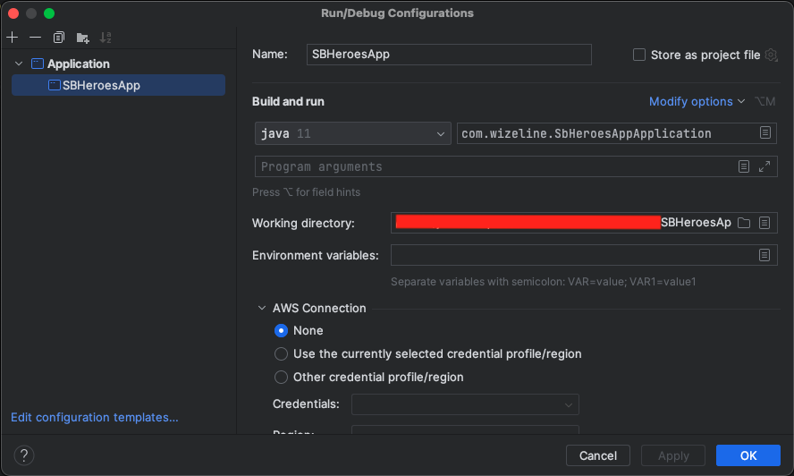

Como  se mencionó anteriormente, el proyecto integra H2 y se puede acceder a la consola mediante: http://localhost:8080/h2-ui/

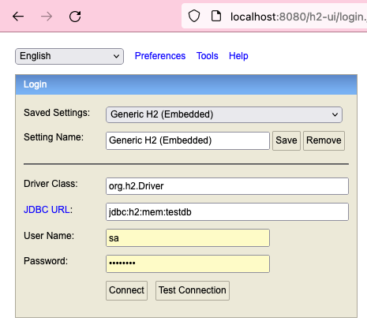

La aplicación expone un endpoint que se puede alcanzar desde la URL: http://localhost:8080/api

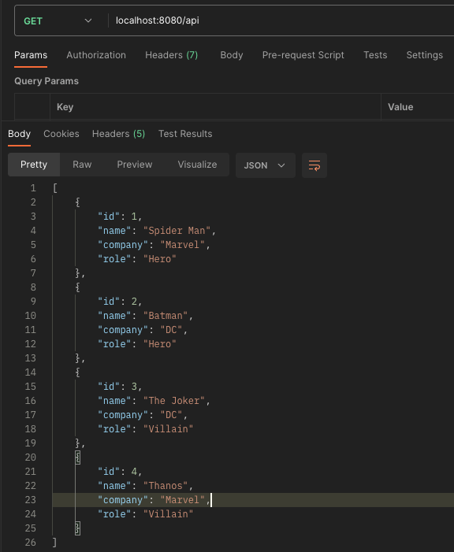


## Bean Scope

#### Singleton

1. Creamos una clase, que definiremos como Bean, en el paquete service:

```java
public class LoggingService {

    private String message;

    public void getMessage() {
        System.out.println("Logging: " + message +
                " hashcode: " + this.hashCode());
    }

    public void setMessage(String message) {
        this.message = message;
    }
}
```

2. En la clase principal (SbHeroesAppApplication) de la aplicación marcamos como Bean la clase creada:

```java
@Bean
public LoggingService loggingService() {
    return new LoggingService();
}
```

3. Por último, basta con hacer la implementación e invocación de los métodos de la clase:

```java
public class CharacterController {
    // código
    @Autowired
    private LoggingService singletonService;

    @GetMapping
    public ResponseEntity<List<Character>> getAllCharacters() {
        singletonService.setMessage("getAllCharacters from controller executed");
        singletonService.getMessage();
        return ResponseEntity.ok(characterService.getAllCharacters());
    }
}
```

4. Resultado:

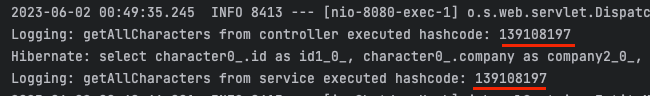


#### Prototype
Para la creación del Bean con scope prototype los pasos son muy similares al anterior.

1. Creamos una clase, que definiremos como Bean, en el paquete service:

```java
 public class RoleService {

    private List<Character> roles;

    public void getRoles() {
        System.out.println(roles
                + " hashcode: " + this.hashCode());
    }

    public void setRoles(List<Character> roles) {
        this.roles = roles;
    }
}
 ```

2. En la clase principal (SbHeroesAppApplication) de la aplicación marcamos como Bean la clase creada, pero ahora será necesario definir el Scope:

```java
@Bean
@Scope(ConfigurableBeanFactory.SCOPE_PROTOTYPE)
public RoleService roleService() {
    return new RoleService();
}
 ```

3. Por último, basta con hacer la implementación e invocación de los métodos de la clase:

 ```java
public class CharacterController {
    // código
    @Autowired
    private RoleService heroes;

    @Autowired
    private RoleService villains;

    @GetMapping
    public ResponseEntity<List<Character>> getAllCharacters() {
        // código
        List<Character> heroesList;
        List<Character> villainsList;

        heroesList = characterService.getAllCharacters().stream()
                .filter(character -> character.getRole().equals("Hero")).collect(Collectors.toList());
        heroes.setRoles(heroesList);
        heroes.getRoles();

        villainsList = characterService.getAllCharacters().stream()
                .filter(character -> character.getRole().equals("Villain")).collect(Collectors.toList());
        villains.setRoles(villainsList);
        villains.getRoles();
        return ResponseEntity.ok(characterService.getAllCharacters());
    }
}
 ```

4. Resultado:

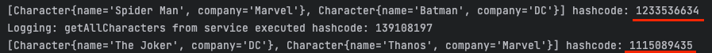


#### Session

1. Creamos una clase, que definiremos como Bean, en el paquete service:

 ```java
 public class SessionService {

    private String message;

    public void getMessage() {
        System.out.println("Session: " + message
                + " hashcode: " + this.hashCode());
    }

    public void setMessage(String message) {
        this.message = message;
    }
}
 ```

2. En la clase principal (SbHeroesAppApplication) de la aplicación marcamos como Bean la clase creada, pero ahora será necesario definir el Scope:

```java
@Bean
@SessionScope
public SessionService sessionService() {
    return new SessionService();
}
```

3. Por último, basta con hacer la implementación e invocación de los métodos de la clase:

```java
public class CharacterController {
    // código
    @Autowired
    private SessionService sessionService;
    
    @GetMapping
    public ResponseEntity<List<Character>> getAllCharacters() {
        // código
        ServletRequestAttributes servletRequestAttributes =
                (ServletRequestAttributes) RequestContextHolder.currentRequestAttributes();
        String session = servletRequestAttributes.getSessionId();

        sessionService.setMessage(session);
        sessionService.getMessage();


        return ResponseEntity.ok(characterService.getAllCharacters());
    }
    
}
```

4. Resultado:

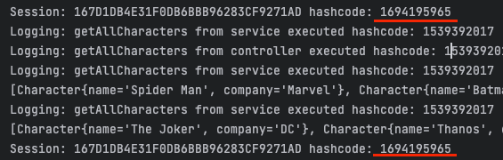

## IoC Containers
Para las siguientes actividades se reutilizará código generado en las actividades previas.

### Bean Factory

1. Para la manipulación de un Bean utilizando BeanFactory utilizaremos la clase LoggingService, será necesario remover el bloque de código donde lo marcábamos como Bean en la clase principal de la aplicación.


2. Crearemos un archivo .xml, donde crearemos los beans, dentro de la carpeta resources. Dicho archivo tendrá el siguiente contenido:
```xml
<?xml version="1.0" encoding="UTF-8"?>
<beans xmlns="http://www.springframework.org/schema/beans"
       xmlns:xsi="http://www.w3.org/2001/XMLSchema-instance"
       xsi:schemaLocation="http://www.springframework.org/schema/beans
           http://www.springframework.org/schema/beans/spring-beans.xsd">

    <bean id="logging"
          class="com.wizeline.service.LoggingService"
          scope="singleton"/>

</beans>
```

3. A continuación se hace la inyección del bean en la clase para su utilización.
> En necesario remover la invocación previa, donde se uso @Autowired
```java
public class CharacterController {
    // código

    @GetMapping
    public ResponseEntity<List<Character>> getAllCharacters() {

        BeanFactory beanFactory = new XmlBeanFactory(new ClassPathResource("beans.xml"));
        
        LoggingService loggingService = (LoggingService) beanFactory.getBean("logging");
        loggingService.setMessage("Bean created using Bean Factory");
        loggingService.getMessage();
        
        return ResponseEntity.ok(characterService.getAllCharacters());
    }
    
}
```

4. Resultado:

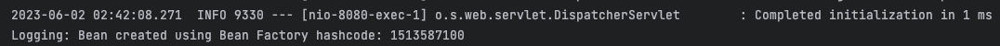

### ApplicationContext

1. Para la manipulación de un Bean utilizando ApplicationContext utilizaremos la clase RoleService, será necesario remover el bloque de código donde lo marcabamos como Bean en la clase principal de la aplicación.


2. Crearemos un archivo .xml, donde crearemos los beans, dentro de la carpeta resources. Dicho archivo tendrá el siguiente contenido:
```xml
<?xml version="1.0" encoding="UTF-8"?>
<beans xmlns="http://www.springframework.org/schema/beans"
       xmlns:xsi="http://www.w3.org/2001/XMLSchema-instance"
       xsi:schemaLocation="http://www.springframework.org/schema/beans
           http://www.springframework.org/schema/beans/spring-beans.xsd">

    <bean id="logging"
          class="com.wizeline.service.LoggingService"
          scope="singleton"/>

    <bean id="roleService"
          class="com.wizeline.service.RoleService"
          scope="prototype"/>

</beans>
```

3. A continuación se hace la inyección del bean en la clase para su utilización.
> En necesario remover la invocación previa, donde se uso @Autowired
```java
public class CharacterController {
    // código

    @GetMapping
    public ResponseEntity<List<Character>> getAllCharacters() {

        ApplicationContext context=new ClassPathXmlApplicationContext("beans.xml");

        RoleService heroes = (RoleService) context.getBean("roleService");
        RoleService villains = (RoleService) context.getBean("roleService");

        List<Character> heroesList;
        List<Character> villainsList;

        heroesList = characterService.getAllCharacters().stream()
                .filter(character -> character.getRole().equals("Hero")).collect(Collectors.toList());
        heroes.setRoles(heroesList);
        heroes.getRoles();

        villainsList = characterService.getAllCharacters().stream()
                .filter(character -> character.getRole().equals("Villain")).collect(Collectors.toList());
        villains.setRoles(villainsList);
        villains.getRoles();
        
        return ResponseEntity.ok(characterService.getAllCharacters());
    }
    
}
```

4. Resultado:

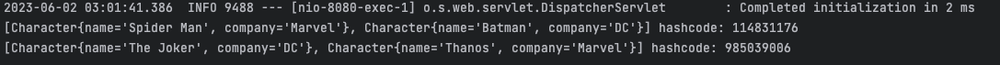


## Transacciones
Para la siguiente actividad se recomienda crear un nuevo endpoint para el manejo de transacciones.

### TransactionManager
1. Se crea una nueva clase Repository dentro del paquete existente.
```java
@Repository
public class CharacterTransactionRepository {

  @Autowired
  private PlatformTransactionManager transactionManager;

  @Autowired
  JdbcTemplate jdbcTemplate;

  public void createNewCharacter(Character character) {
    TransactionDefinition transactionDefinition = new DefaultTransactionDefinition();
    TransactionStatus transactionStatus = transactionManager.getTransaction(transactionDefinition);
    try {
      String sql = "INSERT INTO CHARACTER VALUES (?, ?, ?, ?);";
      jdbcTemplate.update(sql,
              new Object[] { character.getId(), character.getName(), character.getCompany(), character.getRole() });
      transactionManager.commit(transactionStatus);
    } catch (RuntimeException e) {
      transactionManager.rollback(transactionStatus);
      throw e;
    }

  }
}
```

2. En el controller existente será necesario inyectar el componente creado anteriormente, además se puede crear un nuevo endpoint.
```java
public class CharacterController {
    // código
    @Autowired
    private CharacterTransactionRepository repository;

    @PostMapping("/save")
    public ResponseEntity<Character> saveCharacter(@RequestBody Character character) {
      repository.createNewCharacter(character);
      return ResponseEntity.ok(null);
    }
}
```

3. Resultado:

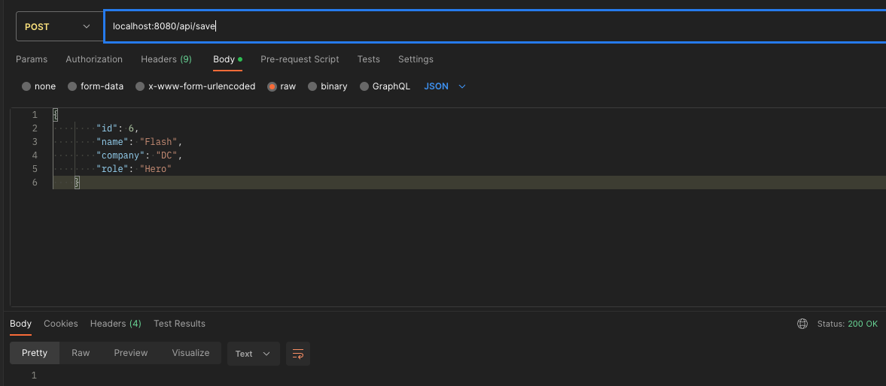
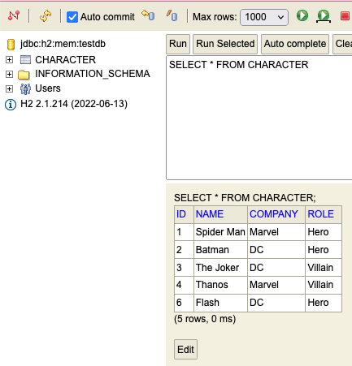


### Transactional
1. En la clase existente CharacterService creamos un nuevo método que nos ayudara a crear registros en la base de datos. La anotación @Transactional la podemos usar a diferentes niveles, en este caso la usamos a nivel de clase.
```java
@Transactional
@Service
public class CharacterService {
    // código
    public Character createCharacter(Character character) {
        return characterRepository.save(character);
    }
}
```


2. Creamos un nuevo endpoint para crear registros.
```java
public class CharacterController {
    @PostMapping
    public ResponseEntity<Character> saveCharacter(@RequestBody Character character) {
        return ResponseEntity.ok(characterService.createCharacter(character));
    }
}
```

3. Hacemos la llamada del nuevo endpoint, en este caso se puede utilizar Postman.
   
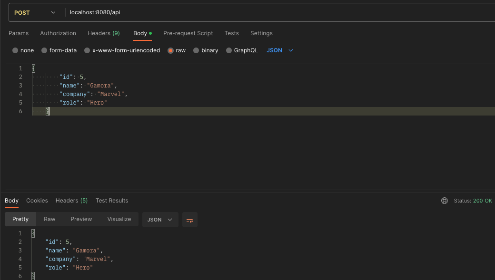

4. Resultado:

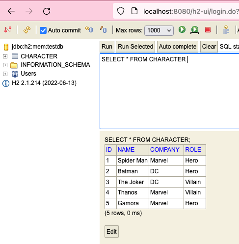


## Filtros
A continuación se creará un filtro sencillo que intercepta las peticiones hechas en la aplicación.

1. Por conveniencia creamos un nuevo paquete llamado filter, en el creamos una clase que anotaremos como @Component e implementaremos de Filter para que pueda ser ejecutado.

```java
@Component
public class RequestLogFilter implements Filter {

    @Override
    public void doFilter(ServletRequest servletRequest, ServletResponse servletResponse, FilterChain filterChain) throws IOException, ServletException {

        HttpServletRequest request = (HttpServletRequest) servletRequest;
        HttpServletResponse response = (HttpServletResponse) servletResponse;

        System.out.println("[Request] " + request.getRequestURI() + " date: " + new Date());

        filterChain.doFilter(request, response);

        System.out.println("[Response] " + HttpStatus.valueOf(response.getStatus()) + " date: " + new Date());
    }

}
```

2. Resultado:

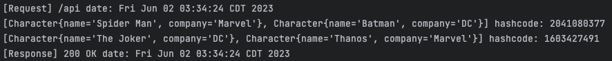

## Spring WebFlux
La siguiente actividad se realiza reutilizando el código ya existente solo haciendo algunas adecuaciones para su correcto funcionamiento. Puede generar nuevas clases y archivos si así lo desea.

También será necesario agregar algunas dependencias a nuestro archivo pom.xml.

```xml
<dependency>
  <groupId>org.springframework.boot</groupId>
  <artifactId>spring-boot-starter-webflux</artifactId>
</dependency>

<dependency>
  <groupId>org.springframework.boot</groupId>
  <artifactId>spring-boot-starter-data-r2dbc</artifactId>
</dependency>

<dependency>
  <groupId>io.r2dbc</groupId>
  <artifactId>r2dbc-h2</artifactId>
  <scope>runtime</scope>
</dependency>
```

### Flux
1. En la clase Repository necesario extender de la clase R2dbcRepository
```java
@Transactional
@Repository
public interface CharacterRepository extends R2dbcRepository<Character, Long> {
}
```

2. También será necesario hacer un cambio en nuestra clase Service, ahora responderá con un Flux.
```java
@Service
public class CharacterService {
    // código
    public Flux<Character> getAllCharacters() {
      return characterRepository.findAll().switchIfEmpty(Flux.empty());
    }
}
```

3. De igual forma será necesario hacer la adecuación en nuestra clase Controller
```java
public class CharacterController {
    // código
    @GetMapping("/flux")
    public Flux<Character> getCharactersUsingFlux() {
      return characterService.getAllCharacters();
    }
}
```


### Mono
Con los cambios hechos anteriormente solo será necesario hacer adecuaciones en la clase Service y Controller.

```java
@Service
public class CharacterService {
  public Mono<Character> createCharacter(Character character) {
    return characterRepository.save(character);
  }
}
```

```java
public class CharacterController {
  // código
  @PostMapping
  public Mono<Character> saveCharacter(@RequestBody Character character) {
    return characterService.createCharacter(character);
  }
}
```


# :books: Recursos
- [Spring Bean Scopes](https://howtodoinjava.com/spring-core/spring-bean-scopes/)
- [Beans](https://docs.spring.io/spring-framework/docs/3.2.x/spring-framework-reference/html/beans.html)
- [Filters in Spring Web Applications](https://springframework.guru/using-filters-in-spring-web-applications/)
- [Spring Boot Filter](https://www.educba.com/spring-boot-filter/)
- [Programacion Reactiva con Spring WebFlux](https://www.cleveritgroup.com/blog/programacion-reactiva-con-spring-webflux-parte-2)
- [Spring WebFlux](https://blog.onesaitplatform.com/2022/07/13/programacion-reactiva-spring-webflux/)

