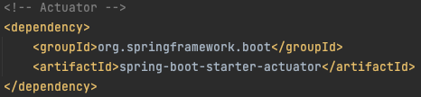
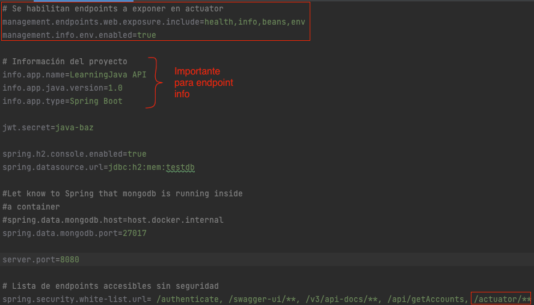
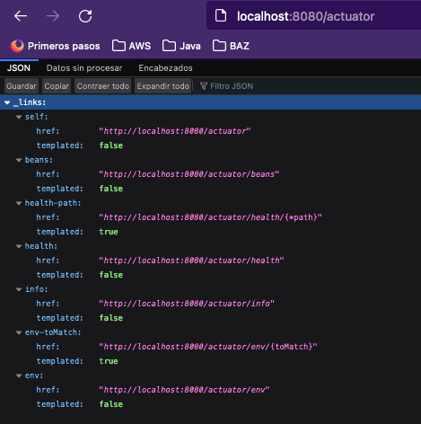
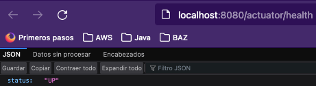
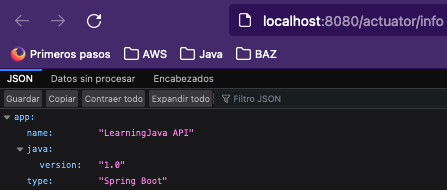

# :tv: Video y Presentacion
- [TBD]
- [TBD]
- [TBD]
# Spring Actuator
# :hammer_and_wrench:  Requisitos
- Java 11
- IDE
    * [Visual Studio Code](https://code.visualstudio.com/download)
    * [IntelliJ](https://www.jetbrains.com/idea/download)
- [Postman](https://www.postman.com/downloads/)

# :pencil: Actividad
> Esta actividad toma como base la última versión del proyecto **LearningJava**. 
> Descrita en la clase anterior: [README](https://github.com/wizelineacademy/BAZJAVA2-2022/blob/main/Semana%204/Security/README.md)
## Habilitar Spring Actuator
1. Lo primero que tenemos que realizar es agregar las dependencias de _Actuator_ en el archivo pom de nuestro proyecto.

   
   
2. Lo siguiente será habilitar los endpoints de _actuator_, esto se hace desde el archivo _properties_.
   

3. Con lo anterior quedaran habilitados los endpoints de actuator.
   #### Actuators
    
   #### Health
   
   #### Info
   

# :books: Recursos
- [Spring Boot Actuator](https://www.baeldung.com/spring-boot-actuators)
- [Spring Boot Actuator: Production-ready features](https://docs.spring.io/spring-boot/docs/2.0.x/reference/html/production-ready.html)