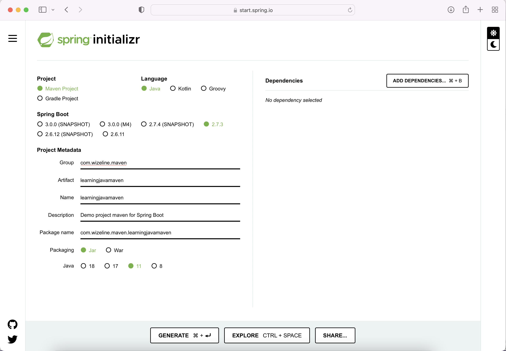
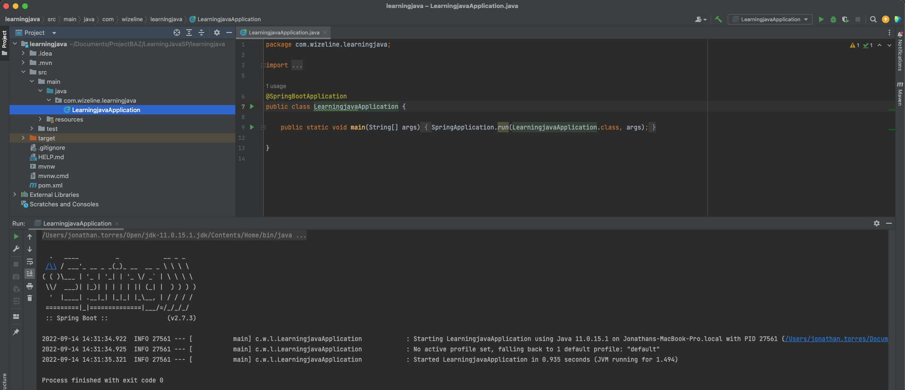
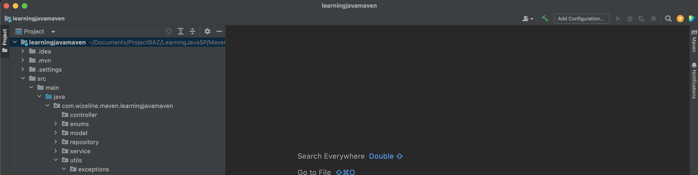
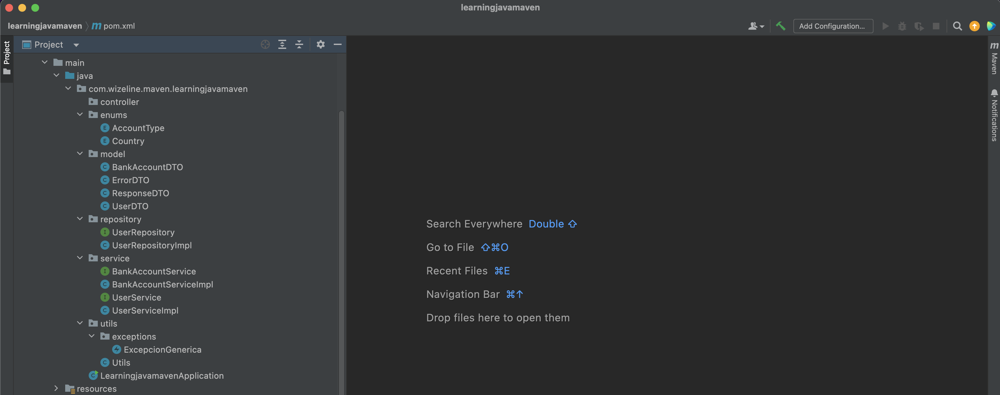
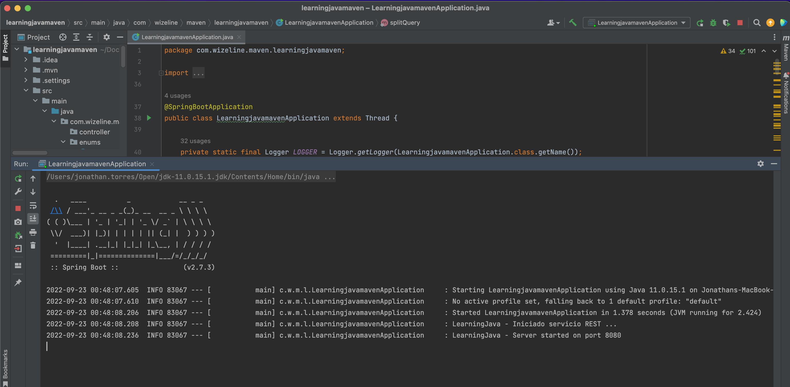

# :computer:  Actividades

## Pre-requisitos de la sesión en vivo :exclamation:

Para realizar este curso es importante tener instalado los siguientes programas::
* [JDK 11](https://www.oracle.com/java/technologies/downloads/)
* [Intellij Idea Community](https://www.jetbrains.com/idea/download/#section=windows)
* [Maven](https://maven.apache.org/download.cgi)

## Java línea de comando
Una vez que JDK y MAVEN sean instalados y configurados, procederemos a validar que este bien instalado para comenzar con la actividad.

### PASO 1: Validar entorno
Abrimos una terminal y validamos si reconoce nuestra versión de Java:

``` bash
# Iniciamos validando que nuestra consola reconosca la versión de Java

jonathan.torres@Jonathans-MacBook-Pro LearningJava1.2 % java -version
java version "11.0.15" 2022-04-19 LTS
Java(TM) SE Runtime Environment 18.9 (build 11.0.15+8-LTS-149)
Java HotSpot(TM) 64-Bit Server VM 18.9 (build 11.0.15+8-LTS-149, mixed mode)

```

Ahora desde una terminal y validamos si reconoce nuestra versión de Maven:

``` bash
# Iniciamos validando que nuestra consola reconosca la versión de Java

jonathan.torres@Jonathans-MacBook-Pro BAZJAVA12022 % mvn -version
Apache Maven 3.8.5 (3599d3414f046de2324203b78ddcf9b5e4388aa0)
Maven home: /Users/jonathan.torres/Open/apache-maven-3.8.5
Java version: 11.0.15, vendor: Oracle Corporation, runtime: /Library/Java/JavaVirtualMachines/jdk-11.0.15.jdk/Contents/Home
Default locale: en_MX, platform encoding: UTF-8
OS name: "mac os x", version: "12.3.1", arch: "x86_64", family: "mac"
jonathan.torres@Jonathans-MacBook-Pro BAZJAVA12022 % 
```


## Temario Día 1

### Spring Initializr

Creación de proyecto

### Active Profiles (Properties files)

Definición e implementación de herencia.

### Manejador de Dependencias (Gradle vs Maven)

Función e implementación de métodos sobrecargados.

### Estructura de un proyecto

Función e implementación de constructores sobrecargados.


## Practica
La practica y ejercicios las podemos encontrar en el directorio de learningjava

### A continuación, se listaran los pasos para a seguir para la actividad de este módulo.

1 . Comenzamos creando un proyecto Spring Boot de tipo Maven, con Java 11 y versión 2.7.*. Para ello lo haremos desde el portal de [Spring Initializr](https://start.spring.io/)




2. Desde IntelliJ importamos el proyecto maven.




3. Ahora contamos con Maven para construir nuestro proyecto, por lo que debemos de agregar las librerias necesarias a nuestro archivo pom.xml:

``` bash
		<dependency>
			<groupId>org.json</groupId>
			<artifactId>json</artifactId>
			<version>20220320</version>
		</dependency>

		<dependency>
			<groupId>com.fasterxml.jackson.core</groupId>
			<artifactId>jackson-databind</artifactId>
			<version>2.13.3</version>
		</dependency>
```

4. Ahora vamos a crear en nuestra carpeta src los siguientes paquetes:
  - com.wizeline.service (Este paquete sustituye al paquete BO)
  - com.wizeline.repository (Este paquete sustituye al paquete DAO)
  - com.wizeline.model (Este paquete sustituye al paquete DTO)
  - com.wizeline.enums
  - com.wizeline.utils
  - com.wizeline.utils.exceptions




5. Comenzaremos a migrar nuestro proyecto LearningJava con el que hemos trabajado a lo largo del curso Java:
  



6. Al mover las clases puede que se presenten errores en los nombres de los package, debemos de realizar la correción y nuestro proyecto debe de iniciar correctamente:

7. Ahora debemos mover nuestras funciones del metodo main a la clase LearningJavaApplication:

``` bash
@SpringBootApplication
public class LearningjavamavenApplication extends Thread {

	private static final Logger LOGGER = Logger.getLogger(LearningjavamavenApplication.class.getName());
	private static final String SUCCESS_CODE = "OK000";
	private static String responseTextThread = "";
	private static String textThread = "";

	public static void main(String[] args) throws IOException {
		SpringApplication.run(LearningjavamavenApplication.class, args);

		LOGGER.info("LearningJava - Iniciado servicio REST ...");
		/** This class implements a simple HTTP server  */
		HttpServer server = HttpServer.create(new InetSocketAddress(8080), 0);
		String msgProcPeticion = "LearningJava - Inicia procesamiento de peticion ...";

		// logear usuario
		server.createContext("/api/login", (exchange -> {
			LOGGER.info(msgProcPeticion);
			ResponseDTO response = new ResponseDTO();
			String responseText = "";
			/** Validates the type of http request  */
			if ("GET".equals(exchange.getRequestMethod())) {
				LOGGER.info("LearningJava - Procesando peticion HTTP de tipo GET");
				UserDTO user = new UserDTO();
				user = user.getParameters(splitQuery(exchange.getRequestURI()));
				response = login(user.getUser(), user.getPassword());
				JSONObject json = new JSONObject(response);
				responseText = json.toString();
				exchange.getResponseHeaders().set("contentType", "application/json; charset=UTF-8");
				exchange.sendResponseHeaders(200, responseText.getBytes().length);
			} else {
				/** 405 Method Not Allowed */
				exchange.sendResponseHeaders(405, -1);
			}
			OutputStream output = exchange.getResponseBody();
			/**
			 * Always remember to close the resources you open.
			 * Avoid memory leaks
			 */
			LOGGER.info("LearningJava - Cerrando recursos ...");
			output.write(responseText.getBytes());
			output.flush();
			output.close();
			exchange.close();
		}));

		// crear usuario
		server.createContext("/api/createUser", (exchange -> {
			LOGGER.info(msgProcPeticion);
			ResponseDTO response = new ResponseDTO();
			String responseText = "";
			/** Validates the type of http request  */
			exchange.getRequestBody();
			if ("POST".equals(exchange.getRequestMethod())) {
				
				StringBuilder text = new StringBuilder();
				try (Scanner scanner = new Scanner(exchange.getRequestBody())) {
					while(scanner.hasNext()) {
						text.append(scanner.next());
					}
				} catch (Exception e) {
					LOGGER.severe(e.getMessage());
					throw new ExcepcionGenerica("Fallo al obtener el request del body");
				}
				LOGGER.info("LearningJava - Procesando peticion HTTP de tipo POST - Create user");
				
				ObjectMapper objectMapper = new ObjectMapper();
				UserDTO user = objectMapper.readValue(text.toString(), UserDTO.class);	
				
				response = createUser(user.getUser(), user.getPassword());
				JSONObject json = new JSONObject(response);
				responseText = json.toString();
				exchange.getResponseHeaders().set("contentType", "application/json; charset=UTF-8");
				exchange.sendResponseHeaders(200, responseText.getBytes().length);
			} else {
				/** 405 Method Not Allowed */
				exchange.sendResponseHeaders(405, -1);
			}
			OutputStream output = exchange.getResponseBody();
			/**
			 * Always remember to close the resources you open.
			 * Avoid memory leaks
			 */
			LOGGER.info("LearningJava - Cerrando recursos ...");
			output.write(responseText.getBytes());
			output.flush();
			output.close();
			exchange.close();
		}));

		// Crear usuarios
		server.createContext("/api/createUsers", (exchange -> {
			LOGGER.info(msgProcPeticion);
			ResponseDTO response = new ResponseDTO();
			/** Validates the type of http request  */
			exchange.getRequestBody();
			if ("POST".equals(exchange.getRequestMethod())) {
				LOGGER.info("LearningJava - Procesando peticion HTTP de tipo POST");

				StringBuilder text = new StringBuilder();
				try (Scanner scanner = new Scanner(exchange.getRequestBody())) {
					while(scanner.hasNext()) {
						text.append(scanner.next());
					}
				} catch (Exception e) {
					LOGGER.severe(e.getMessage());
					throw new ExcepcionGenerica("Fallo al obtener el request del body");
				}
				textThread = text.toString();

				LOGGER.info(textThread);
				LearningjavamavenApplication thread = new LearningjavamavenApplication();
				thread.start();

				while(thread.isAlive());

				exchange.getResponseHeaders().set("contentType", "application/json; charset=UTF-8");
				exchange.sendResponseHeaders(200, responseTextThread.getBytes().length);
			} else {
				/** 405 Method Not Allowed */
				exchange.sendResponseHeaders(405, -1);
			}
			OutputStream output = exchange.getResponseBody();
			/**
			 * Always remember to close the resources you open.
			 * Avoid memory leaks
			 */
			LOGGER.info("LearningJava - Cerrando recursos ...");
			output.write(responseTextThread.getBytes());
			output.flush();
			output.close();
			exchange.close();
		}));

		// Consultar información de cuenta de un usuario
		server.createContext("/api/getUserAccount", (exchange -> {
			LOGGER.info(msgProcPeticion);
			Instant inicioDeEjecucion = Instant.now();
			ResponseDTO response = new ResponseDTO();

			String responseText = "";
			/** Validates the type of http request  */
			if ("GET".equals(exchange.getRequestMethod())) {
				LOGGER.info("LearningJava - Procesando peticion HTTP de tipo GET");
				UserDTO user =  new UserDTO();
				Map<String, String> params = splitQuery(exchange.getRequestURI());
				user = user.getParameters(params);
				// Valida formato del parametro fecha (date) [dd-mm-yyyy]
				String lastUsage = params.get("date");
				if (isDateFormatValid(lastUsage)) {
					// Valida el password del usuario (password)
					if (isPasswordValid(user.getPassword())) {
						response = login(user.getUser(), user.getPassword());
						if (response.getCode().equals(SUCCESS_CODE)) {
							BankAccountDTO bankAccountDTO = getAccountDetails(user.getUser(), lastUsage);
							JSONObject json = new JSONObject(bankAccountDTO);
							responseText = json.toString();
							exchange.getResponseHeaders().add("Content-type", "application/json");
							exchange.sendResponseHeaders(200, responseText.getBytes().length);
						}
					} else {
						responseText = "Password Incorrecto";
						exchange.getResponseHeaders().add("Content-type", "application/json");
						exchange.sendResponseHeaders(401, responseText.getBytes().length);
					}
				} else {
					responseText = "Formato de Fecha Incorrecto";
					exchange.getResponseHeaders().add("Content-type", "application/json");
					exchange.sendResponseHeaders(400, responseText.getBytes().length);
				}
			} else {
				/** 405 Method Not Allowed */
				exchange.sendResponseHeaders(405, -1);
			}
			OutputStream output = exchange.getResponseBody();
			Instant finalDeEjecucion = Instant.now();
			/**
			 * Always remember to close the resources you open.
			 * Avoid memory leaks
			 */
			LOGGER.info("LearningJava - Cerrando recursos ...");
			String total = new String(String.valueOf(Duration.between(inicioDeEjecucion, finalDeEjecucion).toMillis()).concat(" segundos."));
			LOGGER.info("Tiempo de respuesta: ".concat(total));
			output.write(responseText.getBytes());
			output.flush();
			output.close();
			exchange.close();
		}));

		// Consultar información de todas las cuentas
		server.createContext("/api/getAccounts", (exchange -> {
			LOGGER.info(msgProcPeticion);
			Instant inicioDeEjecucion = Instant.now();
			BankAccountService bankAccountBO = new BankAccountServiceImpl();
			String responseText = "";
			/** Validates the type of http request  */
			if ("GET".equals(exchange.getRequestMethod())) {
				LOGGER.info("LearningJava - Procesando peticion HTTP de tipo GET");
				List<BankAccountDTO> accounts = bankAccountBO.getAccounts();
				JSONArray json = new JSONArray(accounts);
				responseText = json.toString();
				exchange.getResponseHeaders().add("Content-type", "application/json");
				exchange.sendResponseHeaders(200, responseText.getBytes().length);
			} else {
				/** 405 Method Not Allowed */
				exchange.sendResponseHeaders(405, -1);
			}
			OutputStream output = exchange.getResponseBody();
			Instant finalDeEjecucion = Instant.now();
			/**
			 * Always remember to close the resources you open.
			 * Avoid memory leaks
			 */
			LOGGER.info("LearningJava - Cerrando recursos ...");
			String total = new String(String.valueOf(Duration.between(inicioDeEjecucion, finalDeEjecucion).toMillis()).concat(" segundos."));
			LOGGER.info("Tiempo de respuesta: ".concat(total));
			output.write(responseText.getBytes());
			output.flush();
			output.close();
			exchange.close();
		}));

		// Consultar todas las cuentas y agruparlas por su tipo utilizando Programación Funcional
		server.createContext("/api/getAccountsGroupByType", (exchange -> {
			LOGGER.info(msgProcPeticion);
			Instant inicioDeEjecucion = Instant.now();
			BankAccountService bankAccountBO = new BankAccountServiceImpl();
			String responseText = "";
			/** Validates the type of http request  */
			if ("GET".equals(exchange.getRequestMethod())) {
				LOGGER.info("LearningJava - Procesando peticion HTTP de tipo GET");
				List<BankAccountDTO> accounts = bankAccountBO.getAccounts();

				// Aqui implementaremos la programación funcional
				Map<String, List<BankAccountDTO>> groupedAccounts;
				Function<BankAccountDTO, String> groupFunction = (account) -> account.getAccountType().toString();
				groupedAccounts = accounts.stream().collect(Collectors.groupingBy(groupFunction));

				JSONObject json = new JSONObject(groupedAccounts);
				responseText = json.toString();
				exchange.getResponseHeaders().add("Content-type", "application/json");
				exchange.sendResponseHeaders(200, responseText.getBytes().length);
			} else {
				/** 405 Method Not Allowed */
				exchange.sendResponseHeaders(405, -1);
			}
			OutputStream output = exchange.getResponseBody();
			Instant finalDeEjecucion = Instant.now();
			/**
			 * Always remember to close the resources you open.
			 * Avoid memory leaks
			 */
			LOGGER.info("LearningJava - Cerrando recursos ...");
			String total = new String(String.valueOf(Duration.between(inicioDeEjecucion, finalDeEjecucion).toMillis()).concat(" segundos."));
			LOGGER.info("Tiempo de respuesta: ".concat(total));
			output.write(responseText.getBytes());
			output.flush();
			output.close();
			exchange.close();
		}));

		/** creates a default executor */
		server.setExecutor(null);
		server.start();
		LOGGER.info("LearningJava - Server started on port 8080");

	}

	@Override
	public void run() {
		try {
			crearUsuarios();
		} catch (Exception e) {
			LOGGER.severe(e.getMessage());
			throw new ExcepcionGenerica(e.getMessage());
		}
	}

	private void crearUsuarios() {
		try {
			String user = "user";
			String pass = "password";
			JSONArray jsonArray = new JSONArray(textThread);
			JSONObject userJson;

			ResponseDTO response = null;

			LOGGER.info("jsonArray.length(): " + jsonArray.length());
			for (int i = 0; i < jsonArray.length(); i++) {
				userJson = new JSONObject(jsonArray.get(i).toString());
				response = createUser(userJson.getString(user), userJson.getString(pass));
				responseTextThread = new JSONObject(response).toString();
				LOGGER.info("Usuario " + (i + 1) + ": " + responseTextThread);
				Thread.sleep(1000);
			}
		} catch (InterruptedException e) {
			throw new RuntimeException(e);
		}
	}

	@Deprecated(since = "Anotaciones update")
	private void createUsers() {
		try {
			String user = "user";
			String pass = "password";
			JSONArray jsonArray = new JSONArray(textThread);
			JSONObject user1 = new JSONObject(jsonArray.get(0).toString());
			JSONObject user2 = new JSONObject(jsonArray.get(1).toString());
			JSONObject user3 = new JSONObject(jsonArray.get(2).toString());

			ResponseDTO response = createUser(user1.getString(user), user1.getString(pass));
			responseTextThread = new JSONObject(response).toString();
			LOGGER.info("Usuario 1: " + responseTextThread);
			Thread.sleep(1000);

			response = createUser(user2.getString(user), user2.getString(pass));
			responseTextThread = new JSONObject(response).toString();
			LOGGER.info("Usuario 2: " + responseTextThread);
			Thread.sleep(1000);

			response = createUser(user3.getString(user), user3.getString(pass));
			responseTextThread = new JSONObject(response).toString();
			LOGGER.info("Usuario 3: " + responseTextThread);
		} catch (InterruptedException e) {
			throw new RuntimeException(e);
		}
	}

	private static ResponseDTO login(String user, String password) {
		UserService UserService = new UserServiceImpl();
		return UserService.login(user, password);
	}

	private static ResponseDTO createUser(String user, String password) {
		UserService UserService = new UserServiceImpl();
		return UserService.createUser(user, password);
	}

	public static Map<String, String> splitQuery(URI uri) {
		Map<String, String> queryPairs = new LinkedHashMap<String, String>();
		String query = uri.getQuery();
		String[] pairs = query.split("&");
		for (String pair : pairs) {
			int idx = pair.indexOf("=");
			queryPairs.put(URLDecoder.decode(pair.substring(0, idx), StandardCharsets.UTF_8),
					URLDecoder.decode(pair.substring(idx + 1), StandardCharsets.UTF_8));
		}
		return queryPairs;
	}

	private static BankAccountDTO getAccountDetails(String user, String lastUsage) {
		BankAccountService bankAccountBO = new BankAccountServiceImpl();
		return bankAccountBO.getAccountDetails(user, lastUsage);
	}

}
```


8. A continuación, ejecutemos el proyecto y hagamos una prueba con los siguientes request:



* [LearningJavaSpring.postman_collection.json](./Postman/LearningJavaSpring.postman_collection.json)


# :books: Para aprender mas
* [Spring Initializr](https://start.spring.io/)
* [Spring Boot](https://docs.spring.io/spring-boot/docs/current/reference/htmlsingle/)
* [Spring REST](https://spring.io/projects/spring-restdocs)
* [Spring MVC](https://spring.io/guides/gs/serving-web-content/)
* [Maven Repository](https://mvnrepository.com/)
