# :tv: Video y Presentacion
- [TBD]
- [TBD]
- [TBD]
# Spring Batch
# :hammer_and_wrench:  Requisitos
- Java 11
- IDE
    * [Visual Studio Code](https://code.visualstudio.com/download)
    * [IntelliJ](https://www.jetbrains.com/idea/download)
- [Postman](https://www.postman.com/downloads/)

# :pencil: Actividad
Durante esta actividad se crearán dos jobs (_bankAccountsBackupJob_ y _printUsersJob_) con el fin de conocer diferentes maneras de ejecutarlos.
- Uno de ellos se ejecutará de forma automática cada cierto periodo de tiempo y simulará el respaldo en un archivo TXT de cuentas existentes en un archivo CSV.
- El otro se ejecutara de forma manual y realizara un procesamiento sobre una lista de usuarios y escribirá el resultado en consola.
> Esta actividad toma como base la última versión del proyecto **LearningJava**.
> Descrita en la clase anterior: [README](https://github.com/wizelineacademy/BAZJAVA2-2022/blob/main/Semana%204/Actuators/README.md)

## Habilitar Spring Batch
1. Lo primero que tenemos que realizar es agregar las dependencias de _Spring Batch_ en el archivo pom de nuestro proyecto.

   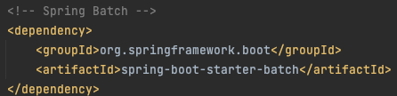

### bankAccountsBackupJob

2. Con la dependencia agregada ahora podremos crear el job _bankAccountsBackupJob_ para lo cual sera necesario crear una clase de Configuración (_@Configuration_) en la cual inyectaremos los objetos de tipo _JobBuilderFactory_ y _StepBuilderFactory_ para crear tanto el _Job_ como un _Step_.
   ```java
   @Configuration
   public class BankAccountJob {
   
   // Inyectar dependencias
   
   /**
     * Crea el job y específica steps y listener.
     * @return bankAccountsBackupJob
     */
    @Bean
    public Job bankAccountsBackupJob() {
        return jobBuilderFactory.get("bankAccountsBackupJob")
                .start(bankAccountsBackupStep(stepBuilderFactory))
                .listener(jobExecutionListener())
                .build();

    }

    /**
     * Se define el step y los procesos para leer, procesar y escribir.
     * @param stepBuilderFactory
     * @return bankAccountsBackupStep
     */
    @Bean
    public Step bankAccountsBackupStep(StepBuilderFactory stepBuilderFactory) {
        return stepBuilderFactory.get("bankAccountsBackupStep")
                .<BankAccountDTO, String>chunk(5).reader(bankAccountsReader())
                .processor(bankAccountItemProcessor()).writer(bankAccountsWriter()).build();
    }
   }
    ```

3. En la misma clase creamos un _itemReader_ y un _itemWriter_ para leer de un archivo y escribir en otro.
   ```java
   @Configuration
   public class BankAccountJob {
    // ..código
    /**
     * Define un itemReader para leer un archivo csv y mapear el contenido usando BankAccountDTO.
     * @return
     */
    @Bean
    public FlatFileItemReader<BankAccountDTO> bankAccountsReader() {
        return new FlatFileItemReaderBuilder<BankAccountDTO>()
                .name("bankAccountsReader")
                .resource(new ClassPathResource("csv/accounts.csv"))
                .delimited().names(new String[] {"country", "accountName", "accountType", "accountBalance", "userName"})
                .targetType(BankAccountDTO.class).build();
    }

    /**
     * Define un itemWriter para escribir en un archivo txt.
     * @return
     */
    @Bean
    public FlatFileItemWriter<String> bankAccountsWriter() {
        return new FlatFileItemWriterBuilder<String>()
                .name("bankAccountsWriter")
                .resource(new FileSystemResource(
                        "target/test-outputs/bankAccountsBackup.txt"))
                .lineAggregator(new PassThroughLineAggregator<>()).build();
    }
   }
   ```
    > Como se puede observar existe un archivo con extension .csv que se lee desde el folder _csv_, en este caso el archivo debe existir en la carpeta resources.
     El archivo contiene la información de algunas cuentas en el formato especificado en el itemReader: "country", "accountName", "accountType", "accountBalance", "userName".
 
4. Continuando en la misma clase, creamos dos métodos uno para invocar un _itemProcessor_ y otro para invocar un _listener_ que escuchara cuando un Job ha terminado su ejecución. 
   ```java
   @Configuration
   public class BankAccountJob {
    // ..código
    @Bean
    public BankAccountItemProcessor bankAccountItemProcessor() {
        return new BankAccountItemProcessor();
    }

    @Bean
    public JobExecutionListener jobExecutionListener() {
        return new BatchJobCompletionListener();
    }
   }
   ```
   > Las clases invocadas son las siguientes:
    - Processor
    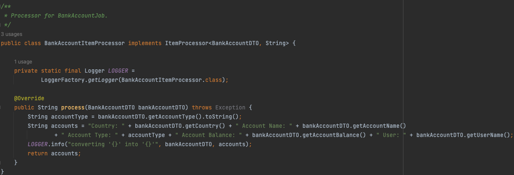
    - Listener
    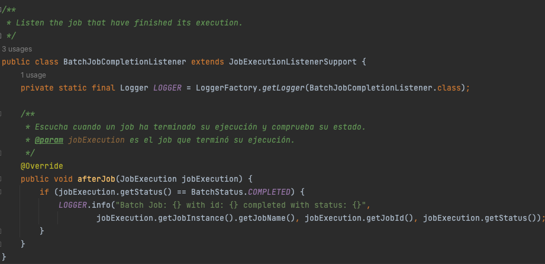


5. Por último para este _job_ es necesario crear una clase de configuración para controlar su ejecución. En este caso se utilizó la anotación _@Scheduled_ para programar la ejecución cada cierto tiempo.
   ```java
   public class BatchConfiguration {
    // Inyectar Job y JobLauncher
    /**
     * Ejecuta el job de bankAccount cada 15 segundos, agrega un par de parámetros al job.
     * @throws Exception
     */
    @Scheduled(fixedRate = 15000)
    public void scheduledByFixedRate() throws Exception {
        SimpleDateFormat format = new SimpleDateFormat("yyyy-MM-dd HH:mm:ss.S");
        LOGGER.info("Batch job starting");
        JobParameters jobParameters = new JobParametersBuilder()
                .addString("launchDate", format.format(Calendar.getInstance().getTime()))
                .addString("project", "LearningJava")
                .toJobParameters();
        jobLauncher.run(bankAccountJob.bankAccountsBackupJob(), jobParameters);
        LOGGER.info("Batch job executed successfully");
    }
   }
   ```
   > En esta clase es importante utilizar las anotaciones _@Configuration_, _@EnableBatchProcessing_ y _@EnableScheduling_.   


6. Ahora podemos ejecutar la aplicación y veriamos el resultado tanto en consola como en el archivo generado por el _job_.
   - Consola
   
   - Archivo
     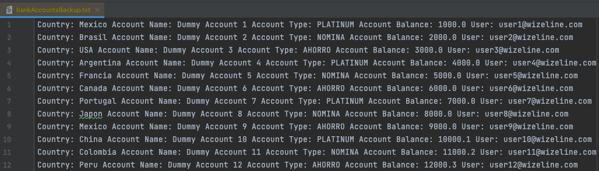
     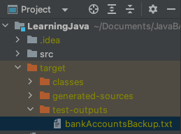
   

### printUsersJob 

7. Al igual que en el _Job_ anterior, creamos uno nuevo con las mismas consideraciones.
   ```java
   @Configuration
   public class UserJob {
    // Código
    @Bean
    public Job printUsersJob() {
        return jobBuilderFactory.get("printUsersJob")
                .incrementer(new RunIdIncrementer())
                .flow(printUserStep())
                .end().listener(new BatchJobCompletionListener())
                .build();

    }

    @Bean
    public Step printUserStep() {
        return stepBuilderFactory.get("printUserStep")
                .<String, String>chunk(3)
                .reader(new UserReader())
                .processor(new UserProcessor())
                .writer(new UserWriter())
                .build();
    }
   }
   ```
   > En este caso se hace la invocación directa del listener y las clases _ItemReader_, _ItemProcessor_ e _ItemWriter_ se crean en archivos separados. 


8. Se crean las clases _ItemReader_, _ItemProcessor_ e _ItemWriter_.
    
   - _ItemReader_ 
   ```java
   public class UserReader implements ItemReader<String> {
    // Código
    private String[] stringArray = {"Phoebe Buffay", "Rachel Green", "Monica Geller", "Chandler Bing", "Ross Geller", "Joey Tribbiani"};

    private int index = 0;

    @Override
    public String read() throws Exception {
        if (index >= stringArray.length) {
            return null;
        }
        String data = index + " " + stringArray[index];
        index++;
        LOGGER.info("UserReader: Reading data: {}", data);
        return data;
    }
   }
   ```
   - _ItemProcessor_
   ```java
   public class UserProcessor implements ItemProcessor<String, String> {
    // Código
    @Override
    public String process(String data) throws Exception {
        LOGGER.info("UserProcessor: Processing data: {}", data);
        data = data.toUpperCase();
        return data;
    }
   }
   ```
   - _ItemWriter_
   ```java
   public class UserWriter implements ItemWriter<String> {
    // Código
    @Override
    public void write(List<? extends String> list) throws Exception {
        for (String data: list) {
            LOGGER.info("UserWriter: Writing data: " + data);
        }
        LOGGER.info("UserWriter: Writing data completed!!");
    }
   }
   ```


9. Este _Job_ se ejecutara de forma manual, por lo tanto sera necesario crear un endpoint (en un nuevo controlador) que invoque su ejecución. 
   ```java
   @Tag(name = "Batch",
        description = "Inicia manualmente un job.")
   @RestController
   @RequestMapping(path = "/batch")
   public class BatchController {

    // Código

    @GetMapping(path = "/start")
    public ResponseEntity<String> startBatch() {
        JobParameters Parameters = new JobParametersBuilder()
                .addLong("startAt", System.currentTimeMillis()).toJobParameters();
        try {
            jobLauncher.run(userJob.printUsersJob(), Parameters);
        } catch (JobExecutionAlreadyRunningException | JobRestartException
                 | JobInstanceAlreadyCompleteException | JobParametersInvalidException e) {
            e.printStackTrace();
        }
        return new ResponseEntity<>("Batch Process started!!", HttpStatus.OK);
      }
    }
   ```


10. Por defecto un _Job_ se ejecuta al momento de que se inicia la aplicación, para evitar eso y controlar la ejecución de estos es necesario agregar lo siguiente en nuestro archivo de propiedades (_.properties_ o _.yml_).
    ```
    spring.batch.job.enabled=false
    ```

11. Iniciamos la aplicación y ejecutamos de forma manual el _Job_.
    - Request
    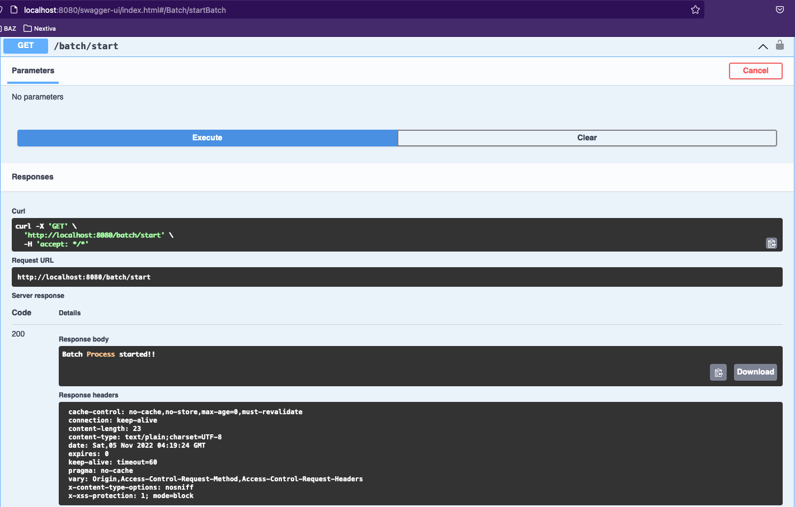
    - Result
    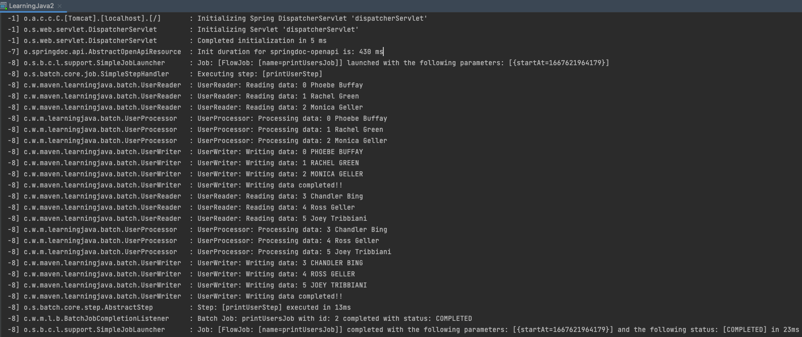


### Extra :bulb:
Existe una forma de ver tanto los _Jobs_, como su información (parametros, etc), que han sido ejecutados. Para hacerlo hay que agregar la dependencia de H2 y habilitar su consola mediante el archivo de propiedades.
    
   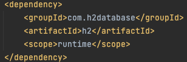  

   ```
    spring.h2.console.enabled=true
    spring.datasource.url=jdbc:h2:mem:testdb
    spring.datasource.username= sa
    spring.datasource.password= password
   ```
Podemos acceder a dicha consola mediante la URL: http://localhost:8080/h2-console utilizando los valores definidos en el archivo de propiedades.

   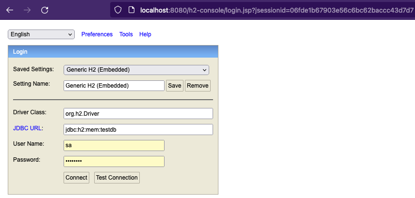

Dentro de la consola podemos consultar la información de los _jobs_, _steps_, etc. que se han ejecutado.
   
   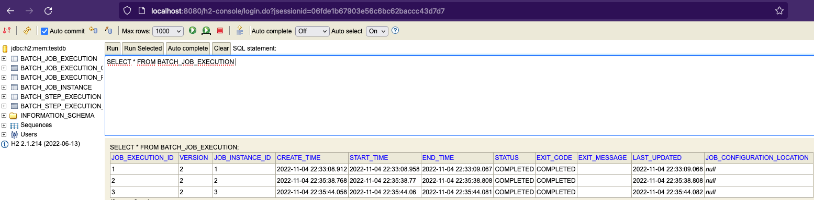
   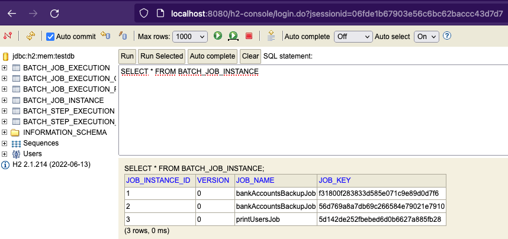


> :warning: Recuerda agregar a la lista de endpoints disponibles sin seguridad a aquellas rutas que lo requieran.
 

# :books: Recursos
- [Introducción a Spring Batch. Toma 1](https://jonasurbano.wordpress.com/2018/07/14/introduccion-a-spring-batch-toma-1/)
- [The Domain Language of Batch](https://docs.spring.io/spring-batch/docs/current/reference/html/domain.html)
- [Chapter 1. Introducing Spring Batch](https://livebook.manning.com/book/spring-batch-in-action/chapter-1/22)
- [Spring Batch - Reference Documentation](https://docs.spring.io/spring-batch/docs/current/reference/html/index.html)
